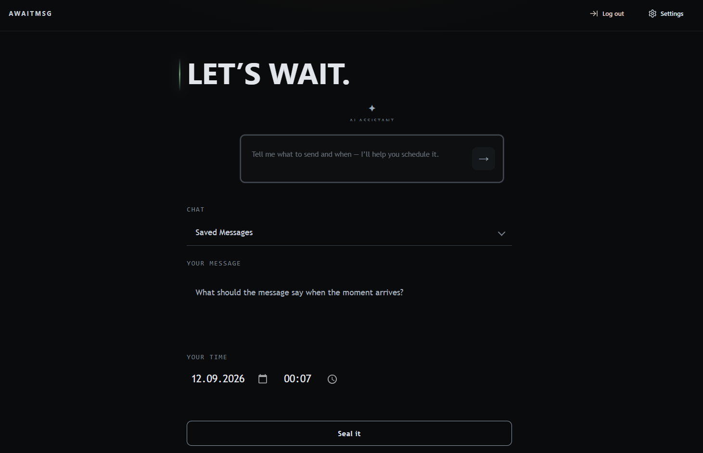
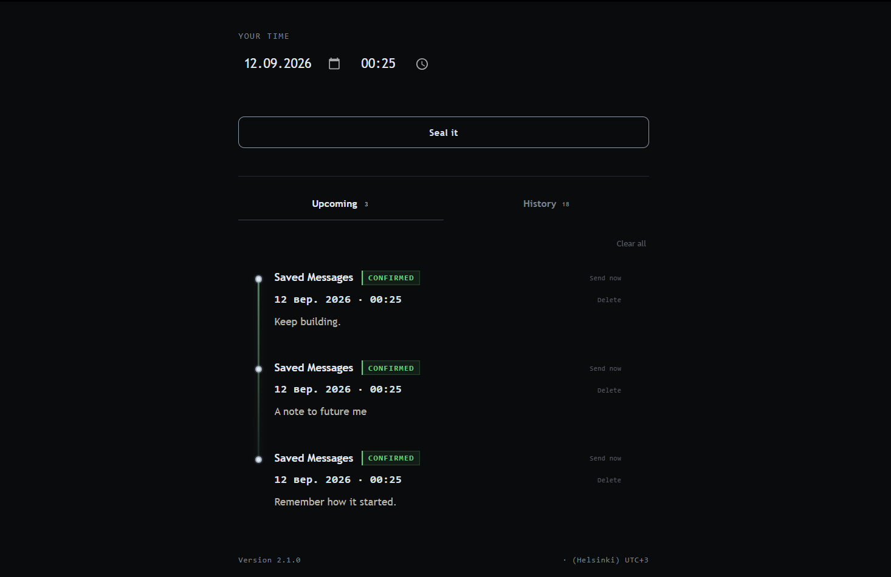
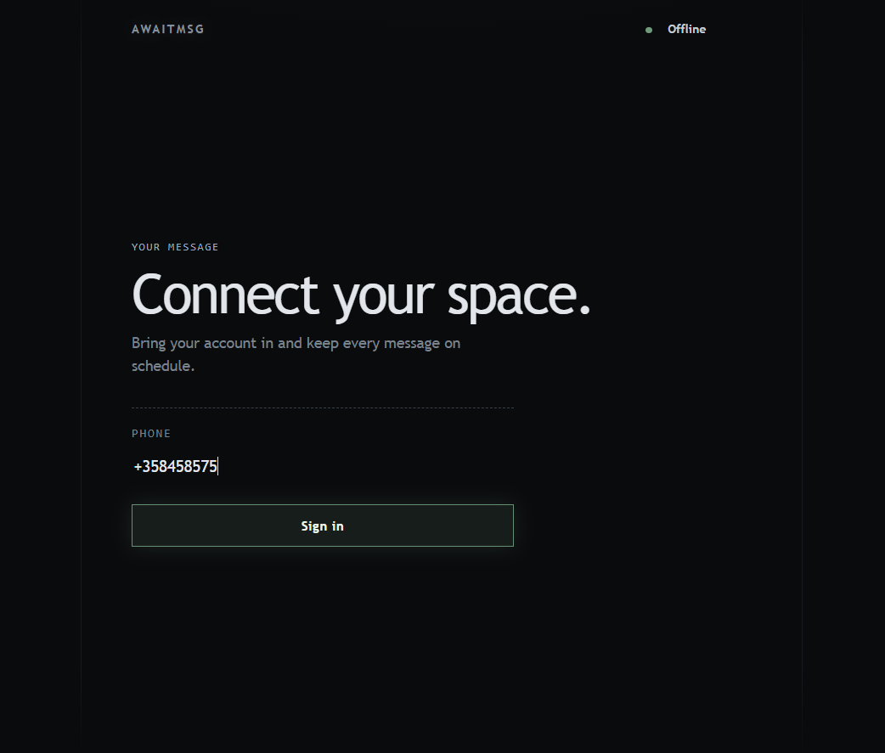

# AwaitMsg

**Let it wait.**

Sometimes you know exactly what you want to say — just not when you want to send it.

AwaitMsg lets you write a message, choose a moment, and leave it there until the right time.

No complicated setup. No extra bots. Just your Telegram account and a message waiting for its moment.

### What you can do

* Write and schedule messages
* Use AI Assistant to help prepare your messages
* See what is waiting to be sent
* Cancel scheduled messages
* Keep track of what you've sent
* Manage everything from one quiet, simple interface

AwaitMsg is made for those small messages that are better sent later.

**Windows · v2.1.3**

## Download

<<<<<<< HEAD
[Download AwaitMsg 2.1.3](../../releases/tag/v2.1.3)
=======
[Download AwaitMsg 2.1.0](../../releases/tag/v2.1.0)
>>>>>>> origin/master
